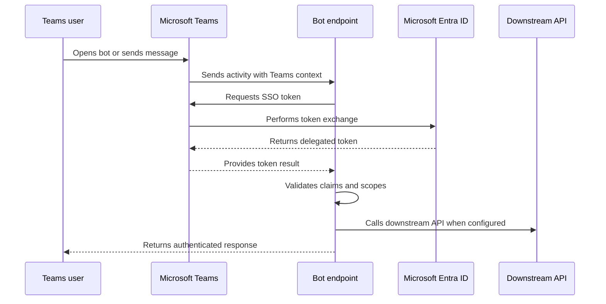

<!-- unified-readme:start -->
<div align="center">

# Teams SSO Bot

**Archived Microsoft Teams SSO bot sample and experimentation project.**

Authenticate. Authorize. Respond.

[](https://github.com/JayRHa/TeamsSSOBot/stargazers)
[](https://github.com/JayRHa/TeamsSSOBot/network/members)
[](https://github.com/JayRHa/TeamsSSOBot/issues)
[](https://github.com/JayRHa/TeamsSSOBot/graphs/contributors)

---

`Teams SSO` | `JavaScript` | `Public` | `Archived`

</div>

## What is this?

Teams SSO Bot is a reference project for understanding how single sign-on works inside a Microsoft Teams bot. It connects the Teams client, Bot Framework bot endpoint, Microsoft Entra ID, and optional downstream API calls into one authentication flow.

## Project Context

- Use it to understand or demonstrate the Teams SSO handshake for a conversational bot.
- The key boundary is token handling: Teams obtains the user token, the bot validates identity and scopes, then continues the conversation or calls a downstream API.
- This repository is archived and kept as a reference implementation.

## How It Works

At runtime, Microsoft Teams sends bot activities to the bot endpoint. When the bot needs identity, Teams performs the SSO token exchange with Microsoft Entra ID and returns a token result that the bot can validate before responding.



## Quick Start

1. Review the project context and workflow below.
2. Clone the repository:

   ```bash
   git clone https://github.com/JayRHa/TeamsSSOBot.git
   ```

3. Continue with the setup, usage, or workflow sections below.

---
<!-- unified-readme:end -->

## Status

This repository is archived and kept for reference.
